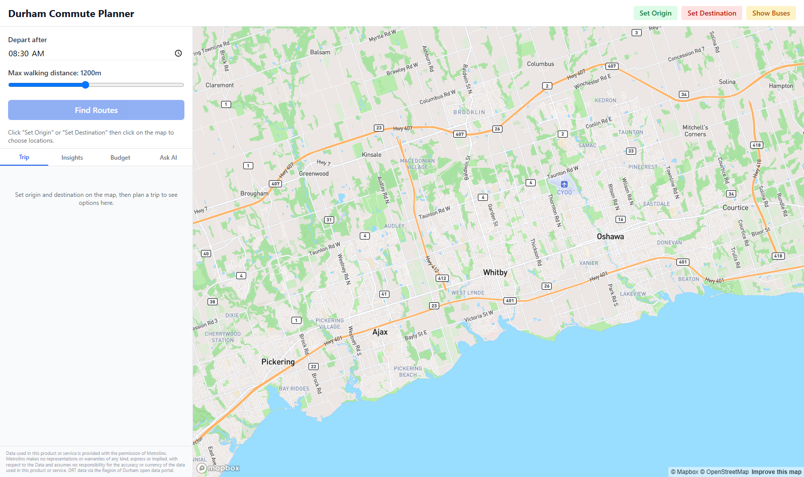

# Durham Commute Planner

A multi-modal trip planning application for Durham Region Transit (DRT) with real-time updates, built with Python (FastAPI) and Next.js (Mapbox GL).



## Live Demo

- **App**: https://commute-planner-mu.vercel.app
- **API**: https://commute-planner-production.up.railway.app

## Features

- **Cross-agency routing**: DRT + GO Transit in one unified connection graph — real Lakeshore East train schedules, walk-transfer edges between bus stops and GO stations
- **Multi-criteria routing**: Pareto-optimal route options (fastest, fewest transfers, least walking)
- **Multimodal comparison**: DRT bus vs drive vs cycle vs walk vs Uber vs taxi — time, cost, CO2, calories
- **Long-distance options**: GO Train, VIA Rail, Megabus, FlixBus, Poparide carpool
- **Commuter intelligence**:
  - Time-value analysis ("cycling pays you $27/hour in savings")
  - Connection fragility scoring (miss-risk % per transfer)
  - Optimal departure windows (±2hr scan with cliff detection)
  - Weekly mode-mix optimizer (cycle dry days, transit wet days)
- **Conversational planner**: Natural-language interface that routes questions to the right engine — cost, timing, reliability, budget, intercity, weather
- **Budget engine**: Monthly money + carbon (CO2) budget tracking with advisor
- **AI surplus advisor**: Rule-based recommendations for leftover budget (food → emergency savings → PRESTO buffer → pass upgrade)
- **What-if scenarios**: Missed bus recovery, leave-later curve, weather impact, monthly pass break-even
- **7-day weather outlook**: Open-Meteo forecast integrated into weekly planning
- **Trip history learning**: Local pattern detection, quick-fill chips for frequent trips
- **Leave-now notifications**: Browser reminders timed to your first bus
- **Live disruption banner**: Watched routes flagged when trips run 5+ min late
- **Real-time updates**: Live bus positions and delay predictions via GTFS-RT
- **Interactive map**: Click to set origin/destination, view route geometry, see live bus locations

## Tech Stack

**Backend**: Python 3.14, FastAPI, GTFS-realtime bindings, SQLite, OR-Tools (routing)
**Frontend**: Next.js 15, React 19, Mapbox GL JS, Tailwind CSS
**Data**: DRT GTFS (static schedule) + GTFS-RT (vehicle positions, trip updates, alerts)

## Quick Start

### Prerequisites
- Python 3.14+
- Node.js 18+
- Mapbox access token (get one at mapbox.com)

### Backend

```bash
cd backend
python -m venv .venv
.\.venv\Scripts\activate  # Windows
# source .venv/bin/activate  # macOS/Linux

pip install -r requirements.txt

# Download and load GTFS data
python gtfs_loader.py

# Start API server (port 8101)
python -m uvicorn api:app --port 8101
```

### Frontend

```bash
cd frontend
npm install

# Set Mapbox token
$env:NEXT_PUBLIC_MAPBOX_TOKEN="your_token_here"  # PowerShell
# export NEXT_PUBLIC_MAPBOX_TOKEN="your_token_here"  # bash

npm run dev
```

Open http://localhost:3000

## API Endpoints

| Method | Endpoint | Description |
|--------|----------|-------------|
| GET | `/health` | Service status + feed health |
| GET | `/stops?q={query}` | Search stops by name |
| POST | `/plan` | Plan routes between coordinates |
| POST | `/compare` | All local modes scored and compared |
| POST | `/whatif` | Scenario analysis |
| POST | `/intercity` | GO/VIA/Megabus/FlixBus/Poparide options |
| POST | `/budget` | Budget analysis + AI surplus advisor (money + CO2) |
| POST | `/insights` | Time-value, fragility, departure windows, weekly plan |
| POST | `/chat` | Conversational planner (natural language → engines) |
| GET | `/disruptions` | Watched routes currently running late |
| GET | `/vehicles` | Live bus positions |
| GET | `/alerts` | Active service alerts |

### POST /plan Request

```json
{
  "from_lat": 43.8759,
  "from_lon": -78.9617,
  "to_lat": 43.8727,
  "to_lon": -78.8554,
  "depart_at": "08:30",
  "max_walk_m": 1200,
  "use_realtime": true
}
```

### Response

```json
[
  {
    "depart": "08:30",
    "arrive": "09:40",
    "duration_min": 70,
    "transfers": 2,
    "walk_m": 307,
    "legs": [
      {
        "mode": "transit",
        "from_name": "McQuay Southbound @ Moonstone",
        "to_name": "Whitby Station",
        "depart": "08:56",
        "arrive": "09:06",
        "route_name": "301",
        "headsign": "Whitby Station",
        "num_stops": 10,
        "geometry": { "type": "LineString", "coordinates": [...] },
        "from_lat": 43.87, "from_lon": -78.96,
        "to_lat": 43.86, "to_lon": -78.93
      }
    ]
  }
]
```

## How It Works

1. **GTFS Ingestion**: Static schedule downloaded from DRT, parsed into SQLite
2. **Connection Scan**: Time-dependent router builds connection graph for service day
3. **Pareto Optimization**: Labels track (arrival, transfers, walking) — non-dominated solutions kept
4. **Multimodal Layer**: OSRM routing for drive/cycle/walk; local fare models for Uber/taxi; DRT fare table
5. **Recommendation Engine**: Weighted scoring (time/cost/green/health) with human-readable explanations
6. **What-if Analysis**: Missed-bus recovery, leave-later curves, weather-aware mode advice, pass break-even
7. **Real-time Layer**: GTFS-RT feeds polled every 30s; delays applied to connection times
8. **Map Rendering**: GTFS shapes sliced between stops, rendered as GeoJSON polylines

## Data Sources

- [Durham Region Transit GTFS](https://maps.durham.ca/OpenDataGTFS/GTFS_Durham_TXT.zip)
- [GO Transit GTFS](https://www.gotransit.com/en/partner-with-us/software-developers) (Metrolinx Open Data)
- [GTFS-RT Vehicle Positions](https://drtonline.durhamregiontransit.com/gtfsrealtime/VehiclePositions)
- [GTFS-RT Trip Updates](https://drtonline.durhamregiontransit.com/gtfsrealtime/TripUpdates)
- [GTFS-RT Service Alerts](https://maps.durham.ca/OpenDataGTFS/alerts.pb)
- [OSRM Demo Server](https://router.project-osrm.org) — driving/cycling/walking routes
- [Open-Meteo](https://open-meteo.com) — weather for scenario analysis

## Attribution

Data used in this product or service is provided with the permission of Metrolinx. Metrolinx makes no representations or warranties of any kind, express or implied, with respect to the Data and assumes no responsibility for the accuracy or currency of the data used in this product or service.

## License

Educational project. Not affiliated with Durham Region Transit.
